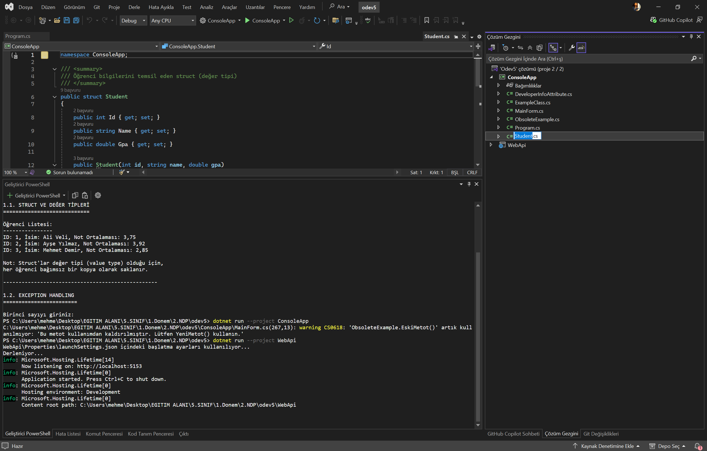

# C# Temelleri, Reflection ve ASP.NET Core Web API Entegrasyonu
## Proje Raporu

**Geliştirici:** Mehmet Karataşlar  
**E-posta:** mehmetkarataslar@gmail.com  
**Tarih:** 10.12.2025

---

## 1. Struct ve Exception Handling

### 1.1. Struct (Değer Tipi) Kullanımı

Bu projede, C# dilinde değer tipi (value type) kavramını göstermek için `Student` adında bir struct tanımlanmıştır. Struct'lar, class'lardan farklı olarak stack'te saklanır ve kopyalanırlar.

#### Kod Örneği:

```csharp
public struct Student
{
    public int Id { get; set; }
    public string Name { get; set; }
    public double Gpa { get; set; }

    public Student(int id, string name, double gpa)
    {
        Id = id;
        Name = name;
        Gpa = gpa;
    }

    public override string ToString()
    {
        return $"ID: {Id}, İsim: {Name}, Not Ortalaması: {Gpa:F2}";
    }
}
```

**Açıklama:** Bu struct, öğrenci bilgilerini temsil eder. Windows Forms uygulamasında, bu struct'tan oluşturulan örnekler bir ListBox içinde gösterilir. Struct'ların değer tipi olması nedeniyle, her öğrenci bağımsız bir kopya olarak saklanır. Bu, referans tiplerinden (class) farklıdır çünkü struct'lar kopyalandığında yeni bir örnek oluşturulur, referans değil.

**Ekran Görüntüsü:**


---

### 1.2. Exception Handling (Hata Yönetimi)

Projede, try-catch-finally yapısı kullanılarak hata yönetimi gerçekleştirilmiştir. Özellikle `DivideByZeroException` ve `FormatException` hataları yakalanmıştır.

#### Kod Örneği:

```csharp
try
{
    int sayi1 = int.Parse(number1TextBox.Text);
    int sayi2 = int.Parse(number2TextBox.Text);
    int sonuc = sayi1 / sayi2;
    resultLabel.Text = $"✓ Sonuç: {sayi1} / {sayi2} = {sonuc}";
    resultLabel.ForeColor = System.Drawing.Color.Green;
}
catch (DivideByZeroException ex)
{
    resultLabel.Text = $"✗ HATA: Sıfıra bölme hatası!\n{ex.Message}";
    resultLabel.ForeColor = System.Drawing.Color.Red;
}
catch (FormatException ex)
{
    resultLabel.Text = $"✗ HATA: Geçersiz format! Lütfen sayı giriniz.\n{ex.Message}";
    resultLabel.ForeColor = System.Drawing.Color.Red;
}
catch (Exception ex)
{
    resultLabel.Text = $"✗ Beklenmeyen hata: {ex.Message}";
    resultLabel.ForeColor = System.Drawing.Color.Red;
}
finally
{
    finallyLabel.Text = ">>> Finally bloğu çalıştı! (Her durumda çalışır)";
}
```

**Açıklama:** Bu kod bloğu, kullanıcıdan alınan iki sayıyı bölme işlemine tabi tutar. `DivideByZeroException`, sıfıra bölme durumunda yakalanır. `FormatException`, kullanıcının sayı yerine harf veya geçersiz karakter girmesi durumunda yakalanır. `finally` bloğu, hata olsun ya da olmasın her durumda çalışır ve bu sayede kaynak temizleme veya loglama işlemleri garanti altına alınır. Windows Forms arayüzünde, hata durumları kırmızı renkte, başarılı işlemler yeşil renkte gösterilir.

**Ekran Görüntüsü:**


---

## 2. Obsolete Attribute

Obsolete attribute, kullanımdan kaldırılacak metotları işaretlemek için kullanılır. Projede iki farklı kullanım örneği bulunmaktadır.

#### Kod Örneği:

```csharp
public class ObsoleteExample
{
    [Obsolete("Bu metot kullanımdan kaldırılmıştır. Lütfen YeniMetot() kullanın.", false)]
    public static void EskiMetot()
    {
        Console.WriteLine("Eski metot çalışıyor...");
    }

    // [Obsolete("Bu metot artık kullanılamaz! Derleme hatası verir.", true)]
    public static void CokEskiMetot()
    {
        Console.WriteLine("Çok eski metot çalışıyor...");
    }

    public static void YeniMetot()
    {
        Console.WriteLine("Yeni metot çalışıyor...");
    }
}
```

**Açıklama:** İlk metot (`EskiMetot`), `[Obsolete(..., false)]` ile işaretlenmiştir. Bu, derleme sırasında sadece bir uyarı (warning) verir ancak kod çalışmaya devam eder. İkinci metot (`CokEskiMetot`), `[Obsolete(..., true)]` ile işaretlenmiştir ve bu durumda derleme hatası (error) verir. Bu nedenle bu metot yorum satırına alınmıştır. Bu yaklaşım, eski API'lerin kademeli olarak kaldırılması için kullanılır.

**Ekran Görüntüleri:**


---

## 3. Custom Attribute ve Reflection

### 3.1. Custom Attribute Tanımı

Projede, geliştirici bilgilerini saklamak için özel bir attribute sınıfı oluşturulmuştur.

#### Kod Örneği:

```csharp
[AttributeUsage(AttributeTargets.Class | AttributeTargets.Method, AllowMultiple = false)]
public class DeveloperInfoAttribute : Attribute
{
    public string DeveloperName { get; }
    public string Version { get; }
    public string Description { get; }
    public DateTime CreatedDate { get; }

    public DeveloperInfoAttribute(string developerName, string version, string description = "")
    {
        DeveloperName = developerName;
        Version = version;
        Description = description;
        CreatedDate = DateTime.Now;
    }
}
```

**Açıklama:** `DeveloperInfoAttribute`, sınıflara ve metotlara uygulanabilen bir custom attribute'dur. Bu attribute, geliştirici adı, versiyon bilgisi, açıklama ve oluşturulma tarihi gibi metadata bilgilerini saklar. `AttributeUsage` ile sadece sınıf ve metotlara uygulanabileceği belirtilmiştir.

### 3.2. Reflection ile Attribute Okuma

Reflection kullanılarak, runtime'da sınıf ve metot bilgileri analiz edilir ve attribute değerleri okunur.

#### Kod Örneği:

```csharp
Type type = typeof(ExampleClass);

// Sınıf üzerindeki attribute'ları kontrol et
var classAttributes = type.GetCustomAttributes(typeof(DeveloperInfoAttribute), false);
if (classAttributes.Length > 0)
{
    foreach (DeveloperInfoAttribute attr in classAttributes)
    {
        Console.WriteLine($"Geliştirici: {attr.DeveloperName}");
        Console.WriteLine($"Versiyon: {attr.Version}");
        Console.WriteLine($"Açıklama: {attr.Description}");
        Console.WriteLine($"Oluşturulma Tarihi: {attr.CreatedDate:yyyy-MM-dd HH:mm:ss}");
    }
}

// Metotları al
MethodInfo[] methods = type.GetMethods(BindingFlags.Public | BindingFlags.Instance | BindingFlags.DeclaredOnly);

foreach (MethodInfo method in methods)
{
    Console.WriteLine($"Metot: {method.Name}");
    Console.WriteLine($"Dönüş Tipi: {method.ReturnType.Name}");
    
    // Metot üzerindeki attribute'ları kontrol et
    var methodAttributes = method.GetCustomAttributes(typeof(DeveloperInfoAttribute), false);
    foreach (DeveloperInfoAttribute attr in methodAttributes)
    {
        Console.WriteLine($"  Geliştirici: {attr.DeveloperName}");
        Console.WriteLine($"  Versiyon: {attr.Version}");
    }
}
```

**Açıklama:** Bu kod, `ExampleClass` tipini analiz eder. `Type.GetType()` veya `typeof()` kullanılarak tip bilgisi alınır. `GetCustomAttributes()` metodu ile sınıf ve metotlar üzerindeki custom attribute'lar okunur. `GetMethods()` ile tüm public metotlar listelenir. Reflection sayesinde, derleme zamanında bilinmeyen tip bilgilerine runtime'da erişilebilir. Bu özellik, dinamik kod analizi, serialization, ve framework geliştirme gibi alanlarda kritik öneme sahiptir.

**Ekran Görüntüleri:**


---

## 4. ASP.NET Core Web API - Middleware ve Filters

### 4.1. Custom Middleware (RequestLoggingMiddleware)

Middleware, HTTP request pipeline'ında çalışan ve her isteği işleyen bileşenlerdir. Projede, request ve response bilgilerini loglayan bir middleware oluşturulmuştur.

#### Kod Örneği:

```csharp
public class RequestLoggingMiddleware
{
    private readonly RequestDelegate _next;
    private readonly ILogger<RequestLoggingMiddleware> _logger;

    public RequestLoggingMiddleware(RequestDelegate next, ILogger<RequestLoggingMiddleware> logger)
    {
        _next = next;
        _logger = logger;
    }

    public async Task InvokeAsync(HttpContext context)
    {
        // Request bilgilerini logla
        var requestMethod = context.Request.Method;
        var requestPath = context.Request.Path;
        var requestTime = DateTime.Now;

        _logger.LogInformation(
            ">>> GELEN İSTEK - Metod: {Method}, URL: {Path}, Zaman: {Time}",
            requestMethod, requestPath, requestTime.ToString("yyyy-MM-dd HH:mm:ss.fff"));

        // Sonraki middleware'i çağır
        await _next(context);

        // Response bilgilerini logla
        var statusCode = context.Response.StatusCode;
        var responseTime = DateTime.Now;

        _logger.LogInformation(
            "<<< DÖNEN YANIT - Status Code: {StatusCode}, Zaman: {Time}",
            statusCode, responseTime.ToString("yyyy-MM-dd HH:mm:ss.fff"));
    }
}
```

**Açıklama:** Bu middleware, her HTTP isteğinin başında ve sonunda çalışır. İstek geldiğinde HTTP metodu, URL ve zaman bilgisini loglar. İstek işlendikten sonra response status code'unu loglar. `_next(context)` çağrısı, pipeline'daki bir sonraki middleware'e geçişi sağlar. Bu sayede tüm API istekleri otomatik olarak loglanır ve izlenebilir hale gelir.

**Program.cs'de Kayıt:**

```csharp
app.UseMiddleware<RequestLoggingMiddleware>();
```

---

### 4.2. Action Filter (PerformanceActionFilter)

Action filter'lar, controller action'larının çalışmasından önce ve sonra çalışan bileşenlerdir. Projede, action'ların çalışma süresini ölçen bir filter oluşturulmuştur.

#### Kod Örneği:

```csharp
public class PerformanceActionFilter : IActionFilter
{
    private const string ActionStartTimeKey = "ActionStartTime";

    public void OnActionExecuting(ActionExecutingContext context)
    {
        // Action başlangıç zamanını kaydet
        context.HttpContext.Items[ActionStartTimeKey] = DateTime.UtcNow;
    }

    public void OnActionExecuted(ActionExecutedContext context)
    {
        // Başlangıç zamanını al
        if (context.HttpContext.Items.TryGetValue(ActionStartTimeKey, out var startTimeObj) && startTimeObj is DateTime startTime)
        {
            var endTime = DateTime.UtcNow;
            var duration = endTime - startTime;

            var controllerName = context.RouteData.Values["controller"]?.ToString() ?? "Unknown";
            var actionName = context.RouteData.Values["action"]?.ToString() ?? "Unknown";

            Console.WriteLine(
                $"[PERFORMANCE] Controller: {controllerName}, Action: {actionName}, " +
                $"Süre: {duration.TotalMilliseconds:F2} ms");
        }
    }
}
```

**Açıklama:** Bu filter, her action'ın başlangıç zamanını `HttpContext.Items` içinde saklar. Action tamamlandığında, geçen süreyi hesaplar ve konsola yazdırır. Bu sayede hangi action'ların ne kadar süre aldığı görülebilir ve performans optimizasyonu yapılabilir. Filter, global olarak kaydedildiği için tüm action'lar için otomatik olarak çalışır.

**Program.cs'de Kayıt:**

```csharp
builder.Services.AddControllers(options =>
{
    options.Filters.Add<PerformanceActionFilter>();
});
```

**Ekran Görüntüsü - Middleware ve Filter Logları:**



---

### 4.3. Exception Filter (GlobalExceptionFilter)

Exception filter'lar, action'larda oluşan beklenmeyen hataları yakalar ve standart bir hata yanıtı döndürür.

#### Kod Örneği:

```csharp
public class GlobalExceptionFilter : IExceptionFilter
{
    private readonly ILogger<GlobalExceptionFilter> _logger;

    public GlobalExceptionFilter(ILogger<GlobalExceptionFilter> logger)
    {
        _logger = logger;
    }

    public void OnException(ExceptionContext context)
    {
        _logger.LogError(context.Exception, "Beklenmeyen hata oluştu");

        var errorResponse = new ErrorResponse
        {
            Message = "Bir hata oluştu. Lütfen daha sonra tekrar deneyin.",
            Details = context.Exception.Message,
            StackTrace = context.HttpContext.RequestServices.GetService<IWebHostEnvironment>()?.IsDevelopment() == true
                ? context.Exception.StackTrace
                : null
        };

        context.Result = new ObjectResult(errorResponse)
        {
            StatusCode = 500
        };

        context.ExceptionHandled = true;
    }
}
```

**Açıklama:** Bu filter, API genelinde oluşan tüm beklenmeyen hataları yakalar. Hata oluştuğunda, hatayı loglar ve istemciye standart bir JSON yanıt döndürür. Development ortamında StackTrace bilgisi de döndürülür, ancak production ortamında güvenlik nedeniyle sadece genel hata mesajı gösterilir. Bu sayede API'den dönen hata yanıtları tutarlı ve güvenli olur.

---

## 5. Reflection Endpoint - Metadata Haritası

### 5.1. SystemController ve GetAttributeMap Endpoint'i

Bu endpoint, Reflection kullanarak API'nin kendi yapısını analiz eder ve tüm controller'lar, action'lar ve HTTP attribute'ları hakkında detaylı bilgi döndürür.

#### Kod Örneği:

```csharp
[HttpGet("attribute-map")]
public ActionResult<Dictionary<string, object>> GetAttributeMap()
{
    var assembly = Assembly.GetExecutingAssembly();
    var controllers = new List<ControllerMetadata>();

    // Tüm tipleri al ve ControllerBase'den türeyenleri filtrele
    var controllerTypes = assembly.GetTypes()
        .Where(t => t.IsSubclassOf(typeof(ControllerBase)) && !t.IsAbstract)
        .ToList();

    foreach (var controllerType in controllerTypes)
    {
        var controllerMetadata = new ControllerMetadata
        {
            ControllerName = controllerType.Name.Replace("Controller", ""),
            FullName = controllerType.FullName ?? controllerType.Name,
            Actions = new List<ActionMetadata>()
        };

        // Controller'daki public metotları al (action'lar)
        var methods = controllerType.GetMethods(BindingFlags.Public | BindingFlags.Instance | BindingFlags.DeclaredOnly)
            .Where(m => !m.IsSpecialName && !m.GetCustomAttributes<NonActionAttribute>().Any())
            .ToList();

        foreach (var method in methods)
        {
            var actionMetadata = new ActionMetadata
            {
                ActionName = method.Name,
                ReturnType = GetReturnTypeName(method.ReturnType),
                HttpMethods = new List<string>(),
                Attributes = new List<string>(),
                Parameters = method.GetParameters()
                    .Select(p => new ParameterMetadata
                    {
                        Name = p.Name ?? "unknown",
                        Type = GetTypeName(p.ParameterType)
                    })
                    .ToList()
            };

            // HTTP method attribute'larını bul
            var httpMethodAttributes = method.GetCustomAttributes()
                .Where(attr => attr.GetType().Name.StartsWith("Http"))
                .ToList();

            foreach (var attr in httpMethodAttributes)
            {
                var attrName = attr.GetType().Name;
                actionMetadata.Attributes.Add(attrName);

                // HTTP method'u çıkar
                if (attrName == "HttpGetAttribute")
                    actionMetadata.HttpMethods.Add("GET");
                else if (attrName == "HttpPostAttribute")
                    actionMetadata.HttpMethods.Add("POST");
                // ... diğer HTTP metodları
            }

            controllerMetadata.Actions.Add(actionMetadata);
        }

        controllers.Add(controllerMetadata);
    }

    var result = new Dictionary<string, object>
    {
        ["timestamp"] = DateTime.UtcNow,
        ["total_controllers"] = controllers.Count,
        ["controllers"] = controllers
    };

    return Ok(result);
}
```

**Açıklama:** Bu endpoint, `Assembly.GetExecutingAssembly()` ile mevcut assembly'deki tüm tipleri alır. `ControllerBase`'den türeyen tüm controller'ları bulur. Her controller için, public metotları (action'lar) analiz eder. Her action için HTTP attribute'larını (`[HttpGet]`, `[HttpPost]`, vb.) okur ve hangi HTTP metodunu desteklediğini belirler. Ayrıca action'ın parametrelerini, dönüş tipini ve diğer attribute'larını da analiz eder. Sonuç olarak, API'nin tam bir haritasını JSON formatında döndürür. Bu özellik, API dokümantasyonu oluşturma, test yazma ve API keşfi gibi senaryolarda çok faydalıdır.

**Endpoint:** `GET /api/system/attribute-map`

**Ekran Görüntüsü:** WebApi.png görselinde middleware logları ve JSON yanıtı birlikte görüntülenmektedir.

**JSON Yanıt Örneği:**

```json
{
  "timestamp": "2024-01-15T10:30:45Z",
  "total_controllers": 2,
  "controllers": [
    {
      "controllerName": "Products",
      "fullName": "WebApi.Controllers.ProductsController",
      "actions": [
        {
          "actionName": "GetAll",
          "returnType": "ActionResult`1",
          "httpMethods": ["GET"],
          "attributes": ["HttpGetAttribute"],
          "parameters": []
        },
        {
          "actionName": "GetById",
          "returnType": "ActionResult`1",
          "httpMethods": ["GET"],
          "attributes": ["HttpGetAttribute"],
          "parameters": [
            {
              "name": "id",
              "type": "Int32"
            }
          ]
        },
        {
          "actionName": "Create",
          "returnType": "ActionResult`1",
          "httpMethods": ["POST"],
          "attributes": ["HttpPostAttribute"],
          "parameters": [
            {
              "name": "product",
              "type": "ProductDto"
            }
          ]
        },
        {
          "actionName": "Delete",
          "returnType": "ActionResult",
          "httpMethods": ["DELETE"],
          "attributes": ["HttpDeleteAttribute"],
          "parameters": [
            {
              "name": "id",
              "type": "Int32"
            }
          ]
        }
      ]
    },
    {
      "controllerName": "System",
      "fullName": "WebApi.Controllers.SystemController",
      "actions": [
        {
          "actionName": "GetAttributeMap",
          "returnType": "ActionResult`1",
          "httpMethods": ["GET"],
          "attributes": ["HttpGetAttribute"],
          "parameters": []
        }
      ]
    }
  ]
}
```

**Not:** WebApi.png görselinde, API'nin çalıştığı konsol ekranı ve middleware/filter logları görüntülenmektedir. JSON yanıtı için Postman veya tarayıcı kullanılabilir.

---

## 6. Sonuç

Bu proje, C# programlama dilinin temel konseptlerini (Struct, Exception Handling, Attributes) ve ileri seviye özelliklerini (Reflection) pratik örneklerle göstermektedir. Ayrıca, ASP.NET Core Web API mimarisinin önemli bileşenlerini (Middleware, Filters, Routing) kullanarak modern bir web API geliştirilmiştir.

**Öğrenilen Konseptler:**
- Değer tipleri (Struct) ve referans tipleri arasındaki farklar
- Try-catch-finally yapısı ile hata yönetimi
- Obsolete attribute ile API versiyonlama
- Custom attribute oluşturma ve kullanma
- Reflection ile runtime tip analizi
- ASP.NET Core middleware pipeline'ı
- Action filter'lar ile cross-cutting concern'lerin yönetimi
- Exception filter'lar ile global hata yönetimi
- Reflection kullanarak dinamik API analizi

Bu proje, modern yazılım geliştirme tekniklerini öğrenmek ve uygulamak için kapsamlı bir örnek teşkil etmektedir.

---

**Rapor Hazırlayan:** Mehmet Karataşlar  
**Tarih:** 10.12.2025

